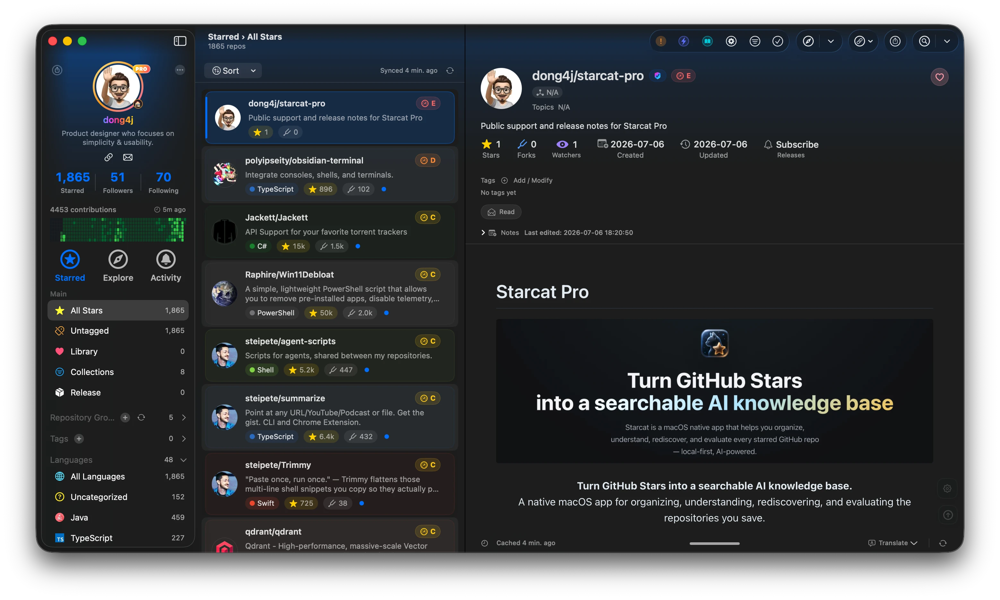

<div align="center">
<a href="https://starcat.ink"></a>

<h2>Starcat Pro</h2>
<p>GitHub Stars 管理、README 渲染、AI 摘要、语义搜索、Release 追踪、仓库健康度、Browser Plugin、CodeFlow、CodebaseMemory 等能力。</p>

<a href="https://github.com/starcat-app/homebrew-starcat"></a><br/>
<sub>
<b>macOS 15 Sequoia 或更高版本</b>：优先使用 <a href="https://github.com/starcat-app/homebrew-starcat">Homebrew</a> 安装，也可以下载面向 Apple Silicon Mac 的 <a href="https://starcat.ink/downloads/Starcat-1.0.0-arm64.dmg">当前 Direct 版本</a>。<br>
历史版本与发布说明：<a href="./CHANGELOG-ZH.md">更新日志</a> · <a href="https://starcat.ink/changelog.html">官网更新记录</a><br>
公开问题反馈：<a href="https://github.com/starcat-app/starcat-pro/issues">反馈 bug 或提出功能建议</a><br>
English: <a href="./README.md">README.md</a>
</sub>
</div>

<br />

<div align="center">
<a href="https://starcat.ink"></a>
<a href="https://starcat.ink/downloads/Starcat-1.0.0-arm64.dmg"></a>
<a href="https://github.com/starcat-app/starcat-localization"></a>
<a href="https://github.com/starcat-app/starcat-pro/issues"></a>
</div>

<br />

## About Starcat

**Starcat** 是一款原生 macOS 应用，面向 GitHub Stars 已经超出普通收藏夹规模的用户。它把 starred repositories 同步到本地优先的桌面工作区，渲染 README，支持标签、私有笔记和阅读状态，追踪 Release，评估仓库健康度，并帮助你把收藏过的项目变成可复用的知识库。启用 AI 后，Starcat 可以生成 README 摘要、翻译项目文档、推荐标签、基于仓库上下文问答，并为 Pro 用户准备更深入的代码智能工作流。

<div align="center">

</div>

## Key Features

- **原生 GitHub Stars 管理器** - 使用 GitHub 登录，同步 starred repositories，并在 macOS 三栏界面中浏览。
- **本地优先数据模型** - 标签、私有笔记和状态保存在本地 SQLite；仓库缓存可重建。
- **README 渲染** - 阅读 GitHub README，支持图片处理、滚动工具和专注阅读界面。
- **AI 结构化摘要** - 生成仓库摘要，解释项目做什么、解决什么问题、使用什么技术栈。*
- **README 翻译** - 翻译仓库 README，同时保留原始项目上下文。*
- **仓库级 AI 对话** - 围绕当前仓库上下文提问。*
- **标签、笔记和状态** - 用自定义标签、私有笔记、阅读状态或使用状态组织仓库。
- **批量整理** - 多选仓库后批量打标或执行操作。
- **全文搜索** - 使用本地 FTS5 索引搜索仓库名、作者、描述、topics 和笔记。
- **语义搜索** - 启用 AI 搜索后，可以按意图找仓库，而不只依赖精确关键词。*
- **Release 订阅** - 订阅重要仓库，查看新版本，并让关键更新保持可见。
- **Repo Health 和 OpenSSF 信号** - 在应用内查看维护活跃度、安全和健康度信号。
- **Explore 和发现视图** - 浏览 Trending、Discovery、GitHub 搜索和仓库榜单。
- **Browser Plugin 工作流** - 在 GitHub 页面中使用 Starcat 上下文、笔记、标签、健康度和 AI 操作。
- **分享卡片** - 为仓库和个人资料生成视觉卡片。
- **CodeFlow 和 CodebaseMemory 工作流** - 为 Pro 用户准备更深入的代码图谱和仓库智能分析。*
- **Direct 分发** - 当前 macOS Direct 版本支持 Sparkle 应用内更新。
- **本地化** - 已支持英文和简体中文，公开本地化资源仓库接受社区贡献。

更多能力会随着 Starcat Pro 稳定继续加入。

_注：带星号 (*) 的能力是 Pro 方向工作流，或依赖当前应用版本中启用的 AI/provider。Pro 购买尚未开放。_

## Getting Starcat Pro

Starcat 目前以 macOS Direct 版本提供。核心整理能力免费，Pro 工作流、更高 AI 配额和高级代码智能能力仍在准备中。

- 从官网下载 Starcat：https://starcat.ink
- Homebrew tap：https://github.com/starcat-app/homebrew-starcat
- 当前 Direct 版本：https://starcat.ink/downloads/Starcat-1.0.0-arm64.dmg
- 发布说明：https://starcat.ink/changelog.html

Pro 购买尚未开放。最终价格、权益规则和支付流程会在 Starcat Pro 开放时公布。

欢迎 star GitHub 页面、试用应用并反馈问题，这会帮助公开版本更快变好。

## Installation

首选使用 Homebrew 安装：

```bash
brew tap starcat-app/starcat
brew trust starcat-app/starcat
brew install --cask starcat
```

也可以手动安装：

1. 从 https://starcat.ink 下载最新 Direct `.dmg`。
2. 打开 `.dmg` 文件。
3. 把 Starcat 拖到 `/Applications`。
4. 从 `/Applications`、Launchpad 或 Spotlight 启动 Starcat。
5. 使用 GitHub 登录，或使用支持的 token 登录流程。

## Using the App

先同步你的 GitHub Stars。之后可以按标签、语言、智能集合、状态、活动和搜索浏览仓库。打开任意仓库详情页后，可以阅读 README、添加笔记、管理标签、订阅 Release、生成 AI 摘要，或启动更深入的仓库工作流。

遇到问题时，请先搜索已有 issue；如果没有对应问题，请创建新 issue，并附上 Starcat 版本、macOS 版本、复现步骤和可用截图。

## Compatibility

- Starcat 当前支持 **macOS 15 Sequoia 或更高版本**。
- 公开 Direct 下载面向 **Apple Silicon Mac**。
- 目前没有 iOS、iPadOS、watchOS、Windows 或 Android 版本。
- AI 能力取决于当前应用版本中配置的 provider 或 API key。
- 仓库缓存可重建；用户创建的标签、笔记和状态属于本地用户数据，需要时应自行备份或导出。

## Browser Extension & Integrations

Starcat 提供 GitHub 页面 companion 工作流。Browser Plugin 可以在 GitHub 页面上下文中展示 Starcat 操作：笔记、标签、健康度、README AI 摘要，以及跳回 macOS 应用的仓库入口。

项目也在准备本地自动化和仓库智能工作流的集成点，例如 CodeFlow 和 CodebaseMemory。

### Browser Plugin Projects

- [starcat-chrome-plugin](https://github.com/starcat-app/starcat-chrome-plugin) - 用于 GitHub 页面的 Chrome/Chromium companion extension。
- [starcat-safari-plugin](https://github.com/starcat-app/starcat-safari-plugin) - 面向 macOS 的 Safari WebExtension companion package。

### Self-Hostable API Projects

Starcat 使用多个小型支撑 API 来提供可选的发现、分享和仓库智能工作流。这些服务已开源，进阶用户可以审查实现、本地运行，或在需要完全控制服务端时自行部署。

- [starcat-sharing-api](https://github.com/starcat-app/starcat-sharing-api) - 分享页面生成与渲染支撑服务。
- [starcat-trending-api](https://github.com/starcat-app/starcat-trending-api) - GitHub Trending 抓取与 API。
- [starcat-weekly-api](https://github.com/starcat-app/starcat-weekly-api) - 周刊项目源聚合与 API。
- [starcat-wiki-api](https://github.com/starcat-app/starcat-wiki-api) - GitHub Wiki 与文档可用性探测。
- [starcat-recommend-api](https://github.com/starcat-app/starcat-recommend-api) - 相似仓库推荐代理。
- [starcat-discovery-api](https://github.com/starcat-app/starcat-discovery-api) - 探索发现、热门和新发布仓库 feed。

每个 API 项目都有自己的 README 和部署说明。Starcat 默认托管服务面向开箱即用；如果你希望使用自己的基础设施、API key 和数据保留策略，也可以自行部署这些 API。

## Localization

Starcat 支持本地化。公开本地化资源仓库在这里：

https://github.com/starcat-app/starcat-localization

贡献者可以通过 PR 改进翻译，也可以在 localization 仓库的 issue 中附上修改后的 `.xcstrings` 文件。

## Contact & Feedback

请先查看官方主页：https://starcat.ink

这个仓库是 Starcat Pro 的公开支持和发布说明入口。请使用 GitHub Issues 反馈 bug、体验问题和功能建议：

https://github.com/starcat-app/starcat-pro/issues

这个仓库**不包含**应用源码、后端源码、构建脚本或私有配置。
